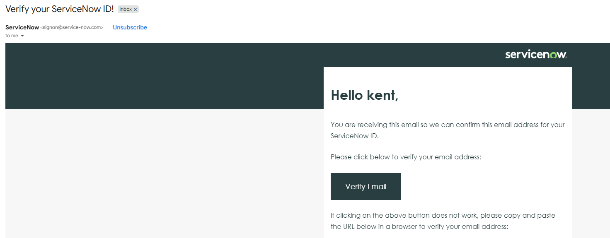
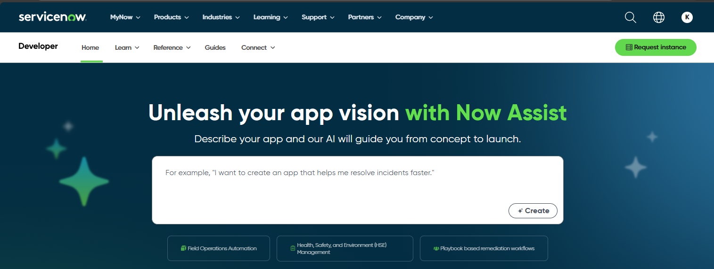

A ServiceNow environment will be required to enable our integration to create and interact with incident tickets.
**Important:** Use your personal email address  when creating your ServiceNow Environment

1. Register a new account with ServiceNow:

    https://signon.service-now.com/x_snc_sso_auth.do?pageId=sign-up

1. Fill out the registration form:

    

1. You will receive a verification email:

    

1. Navigate to the developer portal: 

     https://developer.servicenow.com/dev.do

    If prompted, sign in using the account created above. You may receive an email from ServiceNow with a one time verification code. Multi-factor authentication is not required for this lab. You may skip that step.

1. When prompted to tune your experience, you can select "No, I need a guided experience." You do not have to specifify job responsibilities. Agree to terms of use and click on Finish Setup

1. Request a Developer Instance, by clicking on the Request Instance button in the upper right hand corner.
      

1. Select the latest ServiceNow release.

    

1. Your instance will now get created, this step may take 5-10 minutes. You should receive an email when it is completed and your browser should re-direct to the following screen. Capture the following information in notepad: Dev Instance Name, Username, Password.
    
   

1. Click the Start Building link:

    

1. Your ServiceNow instance has now been setup, and you may proceed to the next module.

