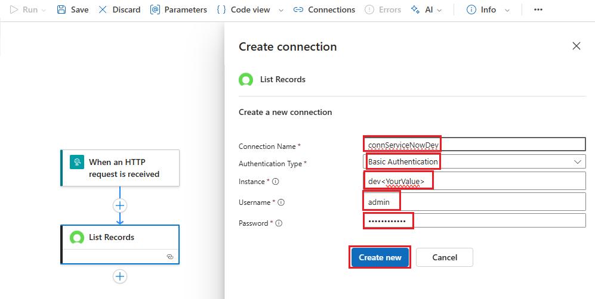
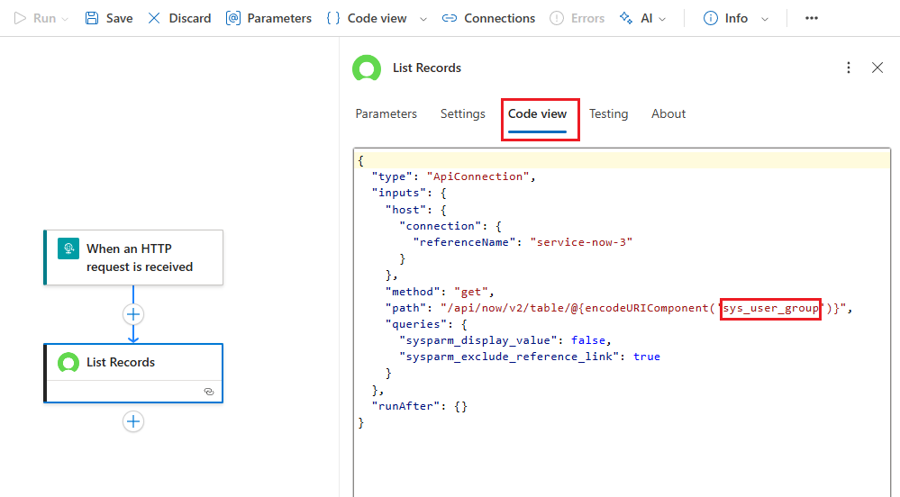

In this module we will create a stateful workflow to create a ServiceNow incident. Our Agent Loop will leverage this workflow as a tool when processing user requests.


## Create Stateful Workflow

1. Create a new workflow:

    - Navigate to the  **Workflows -> Workflows**  section of your Logic app
    - Click `+ Add -> Add`

        

2. Create a new stateful workflow with:
    
    - **Workflow name:** `tool-ServiceNow-CreateIncident`
    - Select the radio button for the `Stateful` workflow type
    - Click `Create`

    

3. Open the workflow visual editor by clicking on the `tool-ServiceNow-CreateIncident` link

    

## Configure Workflow
1. Configure the workflow trigger to accept an HTTP Request
    - Click on `Add Trigger`
    - Select the `Request` action located in the **Built-in tools** group

        
        
    - Select the `When a HTTP request is received`

        

1. Configure the `When a HTTP request is received` action:
    - **Request Body JSON Schema**
        ```JSON
        {
            "type": "object",
            "properties": {
                "AssignmentGroup": {
                "type": "string"
                },
                "Description": {
                "type": "string"
                },
                "FailureDateTime": {
                "type": "string"
                },
                "ResolutionSteps": {
                "type": "string"
                },
                "Severity": {
                "type": "string"
                }
            }
        } 
       ```

1. Look up the internal identifier for the **Assignment Group** in ServiceNow. The Assignment Group is the group of the team that will be responsible for resolving the particular incident. By assigning, this value during ticket creation, we can ensure that it is assigned appropriately.

    - Add a new action. Click `+ Add an action`

        

    - Select the `ServiceNow - List Records` action

        

1. Configure the `ServiceNow - List Records` action. 

    - Configure the Connection:
        - **Connection Name:** `connServiceNowDev`
        - **Authentication Type:** `Basic Authentication`
        - **Instance Name:**  [obtained from Module 4]
            - example: `devXXXXXX` 
            - can also be found in the URL of your developer instance https://[instance name].service-now.com
    - **Username:**  [obtained from Module 4 - ]
            - example: admin
    - **Password:**  [obtained from Module 4 - ]
        - Click `Create new` 

        

1. Configure the List Records Action as follows
    - **Record Type:** `Group`
    - **Advanced Parameters** (click `Show all`)
    - **Query:** `name=@{triggerBody()?['AssignmentGroup']}`

    


    **Note:** ServiceNow has two types of Groups that are available in this dropdown. Unfortunately, the ordering in the dropdown is non-deterministic. To ensure that you have the right Group selected, click on the Code view tab and ensure that 'sys_usr_group' is selected. If you see one that references CMDB, you have the wrong instance and should select the other value from the dropdown.

    
    

1. Add a new action

1. Select the `ServiceNow - Create Record` action

    

1. Configure the Create Record action as follows:
    - **Record Type:** `Incident`
    - **Advanced Parameters:**
        - you can show selected advanced parameters by clicking on the dropdown and select each parameter individually
        - **Short Description:**
            ```
            The following error occurred and needs to be investigated: @{triggerBody()?['Description']} 
            ```
        - **Assignment Group:** 
            ```
            @{first(body('List_Records')?['result'])['sys_id']}
            ```
        - **Description:** 
            ```
            The following workflow failed and needs to be investigated:

            Error Message: @{triggerBody()?['Description']}

            Additional Information: @{triggerBody()?['FailureDateTime']}
            Resolution Steps (from Operation Manual):
            @{triggerBody()?['ResolutionSteps']}
            ```
        - **Severity:** 
            ```
            @{triggerBody()?['Severity']}
            ```
        

1. Add the `Request (Built-in) -> Response` action

    

1. Configure the Response action as follows:
    - **Status Code:** 200
    - **Body:**
        ```JSON
        {
            "TicketNumber": "@{body('Create_Record')?['result']?['number']}"
        }
        ```
    - **Response Body JSON Schema**
        ```JSON
        {
            "type": "object",
            "properties": {
                "TicketNumber": {
                    "type": "string"
                }
            }
        }
        ```
    
    

1. Click `Save` to save the changes made to the workflow

    

    You should see a notification once the workflow is saved.

    


